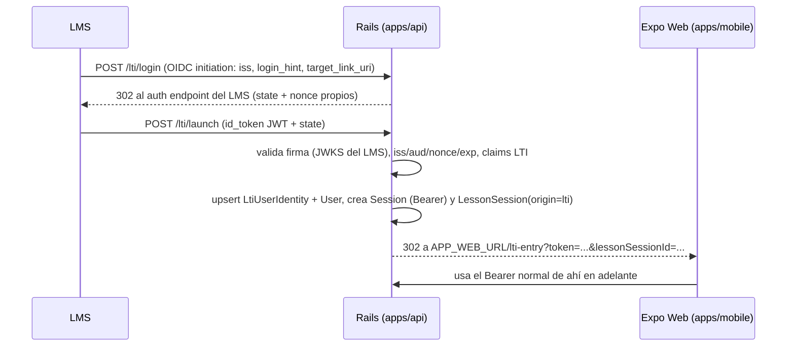

# Contrato: LTI 1.3

Endpoints fuera de `/api/v1` (los consume el LMS, no nuestros clientes). Implementados en
Rails. Referencia: IMS LTI 1.3 Core + Assignment and Grade Services (AGS) 2.0.

## Flujo de launch



## Endpoints

### `GET|POST /lti/login`

OIDC third-party initiated login. Params: `iss`, `login_hint`, `target_link_uri`,
`client_id?`, `lti_message_hint?`. Busca `LtiPlatform` por `iss` (+`client_id`); genera
`state` y `nonce` (guardados server-side con TTL 5 min); redirige al `auth_login_url`.
Plataforma desconocida → 404.

### `POST /lti/launch`

Params: `id_token`, `state`. Validaciones (cada una con error específico, sin stack traces):

1. `state` existe y no expiró; `nonce` del token coincide y no fue usado (anti-replay).
2. Firma del JWT contra el JWKS de la plataforma (cacheado, refetch si kid desconocido).
3. `iss`, `aud` (= client_id), `exp`, `message_type = LtiResourceLinkRequest`, `version = 1.3.0`.
4. Claims requeridos: `sub`, resource_link, context, roles.

Efectos: upsert `lti_user_identities` (+`users` con datos mínimos del claim), upsert
`lti_resource_links` (captura `line_item_url` del claim AGS si viene), crea `Session` y
`LessonSession` con `origin=lti` y el `topic` asociado al resource link. Redirige (302) a
`APP_WEB_URL/lti-entry?token=<bearer>&lessonSessionId=<id>`.

Resource link sin topic asociado → página de configuración pendiente (para el docente).

### `GET /lti/jwks`

JWKS público de la tool (llaves RSA propias, rotables). Usado por el LMS para validar
nuestros client-credentials JWT de AGS.

## AGS (grade passback)

`GradePassbackJob` (Solid Queue), disparado por `POST /lesson_sessions/:id/complete`:

1. Token de acceso: client-credentials JWT firmado con nuestra llave privada contra
   `auth_token_url` de la plataforma, scope `https://purl.imsglobal.org/spec/lti-ags/scope/score`.
2. `POST {line_item_url}/scores` con:

```json
{
  "timestamp": "2026-07-16T18:30:00Z",
  "scoreGiven": 8.5, "scoreMaximum": 10,
  "activityProgress": "Completed", "gradingProgress": "FullyGraded",
  "userId": "<sub del launch>"
}
```

3. Resultado en `grade_syncs` (status, attempts_count, last_error). Reintentos: 5 con backoff
   exponencial. Fallo definitivo → status `failed`, visible para contingencia CSV.

## Registro de plataformas (admin)

`GET/POST/PATCH /api/v1/management/lti_platforms` (rol `admin`): CRUD de
`name, issuer, clientId, authLoginUrl, authTokenUrl, jwksUrl, active`. La respuesta de POST
incluye lo que el admin del LMS necesita para registrar la tool:
`{ "toolLoginUrl", "toolLaunchUrl", "toolJwksUrl", "deepLinkUrl" }`.
