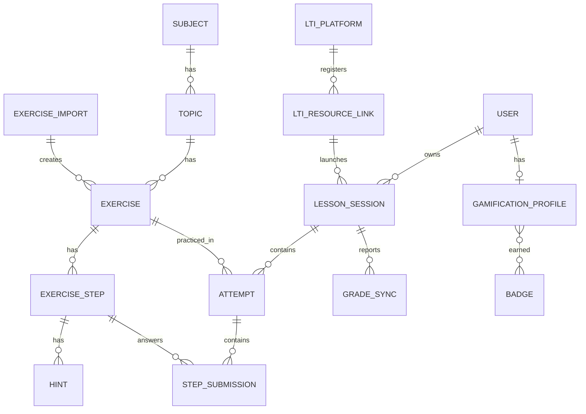

# Data Model: PAAG

Convenciones: nombres en inglés, `snake_case` en DB, migraciones Rails como única fuente de
verdad del schema (nunca editar `db/schema.rb` a mano). Todas las tablas con `created_at`/
`updated_at`. Soft-delete con el concern `Discardable` existente donde se indique.

## Diagrama

## Banco de contenido

### `subjects` (Discardable)
| Columna | Tipo | Notas |
|---|---|---|
| name | string, null: false | ej. "Álgebra básica" |
| slug | string, unique index | |
| position | integer | orden de despliegue |

### `topics` (Discardable)
| Columna | Tipo | Notas |
|---|---|---|
| subject_id | FK, null: false | |
| name / slug / position | como subject | slug único por subject |

### `exercises` (Discardable)
| Columna | Tipo | Notas |
|---|---|---|
| topic_id | FK, null: false | |
| title | string, null: false | |
| statement | text, null: false | Markdown + LaTeX (`$...$`) |
| difficulty | integer enum, null: false | `easy: 0, medium: 1, hard: 2` |
| status | integer enum, default draft | `draft: 0, published: 1, archived: 2` |
| source | integer enum, default manual | `manual: 0, xml_import: 1` |
| exercise_import_id | FK nullable | trazabilidad del import |
| variables | jsonb, default `[]` | `[{"name":"x","domain":{"min":-10,"max":10}}]` para muestreo |
| position | integer, null: false | único por topic; define el orden en el gestor |

### `exercise_steps`
| Columna | Tipo | Notas |
|---|---|---|
| exercise_id | FK, null: false | |
| phase | integer enum, null: false | `identification: 0, planning: 1, tools: 2, procedure: 3` |
| position | integer, null: false | único por exercise; define el orden total |
| prompt | text, null: false | pregunta del paso |
| answer_type | integer enum, null: false | `single_choice: 0, multi_choice: 1, numeric: 2, expression: 3` |
| options | jsonb, default `[]` | `[{"id":"a","label":"..."}]` para choice |
| correct_answer | jsonb, null: false | choice: `["a"]`; numeric: `{"value": 3.5}`; expression: `{"expression":"2*x+1"}` |
| tolerance | decimal, default 0.001 | numeric/expression |
| max_score | integer, default 10 | puntaje base del paso |

### `hints`
| Columna | Tipo | Notas |
|---|---|---|
| exercise_step_id | FK | |
| position | integer | |
| content | text | |
| penalty | integer, default 2 | puntos que resta usarla |

### `exercise_imports`
| Columna | Tipo | Notas |
|---|---|---|
| user_id | FK (auxiliar que subió) | |
| filename | string | |
| status | integer enum | `pending: 0, processing: 1, completed: 2, failed: 3` |
| report | jsonb, default `{}` | `{"created": 12, "rejected": [{"index": 3, "errors": ["..."]}]}` |
| raw_xml | text | contenido original para auditoría |

## Resolución

### `lesson_sessions`
| Columna | Tipo | Notas |
|---|---|---|
| user_id | FK nullable | null para invitados |
| guest_token | string nullable, unique index | identifica sesiones de invitado |
| origin | integer enum, null: false | `public_web: 0, lti: 1` |
| lti_resource_link_id | FK nullable | obligatorio si origin=lti |
| topic_id | FK, null: false | tema practicado |
| status | integer enum | `active: 0, completed: 1, abandoned: 2` |
| final_score | decimal nullable | 0.0–1.0, calculado al completar |

Check constraint: `user_id` o `guest_token` presente (al menos uno).

### `attempts`
| Columna | Tipo | Notas |
|---|---|---|
| lesson_session_id | FK, null: false | |
| exercise_id | FK, null: false | |
| difficulty_choice | integer enum | `keep: 0, increase: 1, decrease: 2, initial: 3` |
| status | integer enum | `in_progress: 0, completed: 1, abandoned: 2` |
| score | integer, default 0 | suma de step_submissions |
| max_score | integer | suma de max_score de los pasos |

### `step_submissions`
| Columna | Tipo | Notas |
|---|---|---|
| attempt_id | FK, null: false | |
| exercise_step_id | FK, null: false | |
| answer | jsonb, null: false | mismo shape que `correct_answer` |
| correct | boolean, null: false | veredicto determinista |
| score | integer | max_score − penalizaciones |
| hints_used | integer, default 0 | |
| ai_feedback | text nullable | feedback semántico si hubo |
| ai_status | integer enum | `skipped: 0, ok: 1, timeout: 2, error: 3` |

## LTI

### `lti_platforms`
| Columna | Tipo | Notas |
|---|---|---|
| name | string | ej. "Moodle producción" |
| issuer | string, null: false | `iss` |
| client_id | string, null: false | único junto a issuer |
| auth_login_url / auth_token_url / jwks_url | string | endpoints de la plataforma |
| active | boolean, default true | |

### `lti_resource_links`
| Columna | Tipo | Notas |
|---|---|---|
| lti_platform_id | FK | |
| resource_link_id | string | del claim LTI |
| context_id / context_title | string | curso en el LMS |
| topic_id | FK | lección asociada al enlace |
| line_item_url | string nullable | endpoint AGS |

### `lti_user_identities`
| Columna | Tipo | Notas |
|---|---|---|
| user_id | FK | usuario local |
| lti_platform_id | FK | |
| subject_id_claim | string | `sub` del id_token; único por platform |

### `grade_syncs`
| Columna | Tipo | Notas |
|---|---|---|
| lesson_session_id | FK | |
| status | integer enum | `pending: 0, sent: 1, failed: 2` |
| score_given / score_maximum | decimal | |
| attempts_count | integer, default 0 | reintentos |
| last_error | text nullable | |

## Gamificación

### `gamification_profiles`
| Columna | Tipo | Notas |
|---|---|---|
| user_id | FK, unique | |
| points | integer, default 0 | |
| current_streak / best_streak | integer, default 0 | días consecutivos con actividad |
| last_activity_on | date nullable | |

### `badges` y `earned_badges`
`badges`: `key` (string, unique), `name`, `description`, `icon` (string). Seeds fijos.
`earned_badges`: `gamification_profile_id` + `badge_id` (unique juntos) + `earned_at`.

## Cambios a tablas existentes

- `users`: ampliar enum `role` con `auxiliary: 2` (migración simple; `admin` y `member` ya existen).
