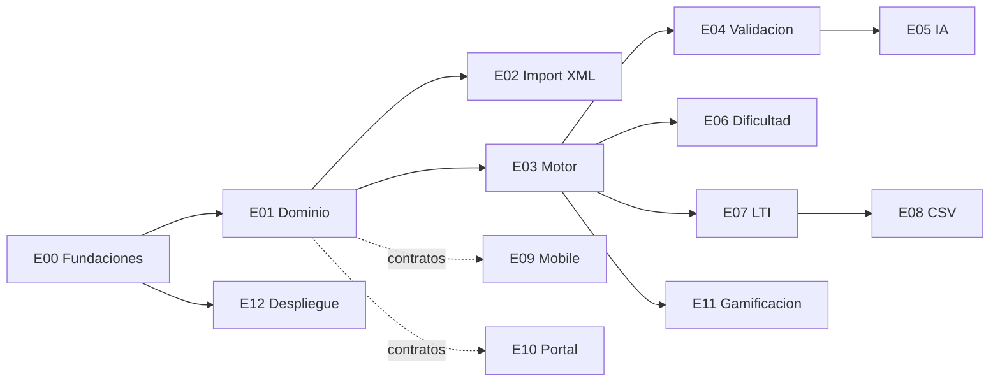

# Tasks: PAAG

**Input**: [spec.md](./spec.md), [plan.md](./plan.md), [data-model.md](./data-model.md), [contracts/](./contracts/)

Cada ticket vive en [`tickets/`](./tickets/) y es **autocontenido**: un agente de Cursor puede
implementarlo leyendo solo ese archivo + los documentos que referencia. Formato de trabajo:

1. Crear rama `feature/paag-xxx-<slug>` desde `main` actualizado.
2. Pedirle al agente: *"Implementa el ticket `@specs/001-paag/tickets/PAAG-XXX-....md` siguiendo `AGENTS.md`"*.
3. Ejecutar los comandos de verificación del ticket; abrir PR pequeño contra `main`.

`[P]` = paralelizable con otros tickets marcados `[P]` de la misma fase (archivos distintos).

## Asignación

| Dev | Ámbito | Tickets |
|---|---|---|
| **A** | Backend (`apps/api`) + contratos | PAAG-004, 101–171, 401 |
| **B** | App estudiante (`apps/mobile`, móvil + web) | PAAG-003, 201–206 |
| **C** | Portal (`apps/portal`) + infra/Docker | PAAG-001, 002, 301–304, 501 |

Guías de arranque por dev: [`team/`](./team/).
Estado operativo Dev C: [`team/STATUS.md`](./team/STATUS.md).

## Estado de QA (importante al reportar)

Protocolo esperado: **implementación → QA adversarial → merge a master**.

| Ticket(s) | En master | QA adversarial | Nota al reportar |
|---|---|---|---|
| PAAG-001, 002 | Sí | **HECHO** (backfill 2026-07-16) | APROBADO / APROBADO CON OBS.; ver `team/STATUS.md` |
| PAAG-301, 302 | Sí | **HECHO** (backfill 2026-07-16) | APROBADO CON OBS. (rol `auxiliary` real pendiente de PAAG-004); tests Vitest añadidos |
| PAAG-501 | Sí (`bdde685` fixes) | **HECHO** — 2 blockers (`database.yml` multi-DB Solid Cache/Queue/Cable; `NEXT_BASE_PATH` en fetch/anchors del portal); fixes en `bdde685` | Smoke `docker compose -f docker-compose.production.yml up` en prod **sigue pendiente** (falta `master.key` / `RAILS_MASTER_KEY` local; **nunca en git**) |
| PAAG-303 | Sí (`dac02ca`) | No documentado / pendiente | Código en master; no reportar “cerrado con QA” |
| PAAG-304 | Sí (`16afd25`) | No documentado / pendiente | Código en master; no reportar “cerrado con QA” |

**No reportar Dev C como “hecho”** mientras falte smoke prod de 501 y QA documentado de 303/304. Backfill QA 001–302 **completado** (2026-07-16). QA adversarial de 501 ya está hecho (fixes mergeados). Ver checklist en [`team/STATUS.md`](./team/STATUS.md).

## Fase E00 — Fundaciones (bloqueante para todo)

- [x] PAAG-001 [C] Identidad del proyecto, variables de entorno y servicio `portal` en Docker Compose — [ticket](./tickets/PAAG-001-fundaciones-envs-compose.md) *(QA backfill 2026-07-16: APROBADO)*
- [x] PAAG-002 [P] [C] Design tokens del styleguide en el portal (Tailwind 4) — [ticket](./tickets/PAAG-002-design-tokens-portal.md) *(QA backfill 2026-07-16: APROBADO)*
- [ ] PAAG-003 [P] [B] Design tokens del styleguide en mobile (Uniwind + fuentes) — [ticket](./tickets/PAAG-003-design-tokens-mobile.md)
- [ ] PAAG-004 [P] [A] Rol `auxiliary` en `User` — [ticket](./tickets/PAAG-004-rol-auxiliary.md)

**Checkpoint**: `docker compose up` levanta db+api+worker+portal; los 3 devs pueden trabajar.

## Fase E01 — Dominio y banco de ejercicios (Dev A; desbloquea B y C vía contratos)

- [x] PAAG-101 [A] Modelos y migraciones del banco (`Subject/Topic/Exercise/ExerciseStep/Hint`) + seeds — [ticket](./tickets/PAAG-101-modelos-banco.md)
- [ ] PAAG-102 [A] Endpoints públicos de lectura de contenido — [ticket](./tickets/PAAG-102-endpoints-contenido-publico.md)
- [ ] PAAG-103 [P] [A] Endpoints de gestión (`/management/exercises`) — [ticket](./tickets/PAAG-103-endpoints-gestion.md)

## Fase E02 — Importador XML (Dev A)

- [ ] PAAG-111 [A] Parser + validador XML contra XSD — [ticket](./tickets/PAAG-111-parser-xml.md)
- [ ] PAAG-112 [A] Job de importación + endpoints + reporte — [ticket](./tickets/PAAG-112-import-job-endpoints.md)

## Fase E03 — Motor de resolución (Dev A)

- [ ] PAAG-121 [A] Modelos de resolución (`LessonSession/Attempt/StepSubmission`) + sesión invitado — [ticket](./tickets/PAAG-121-modelos-resolucion.md)
- [ ] PAAG-122 [A] Endpoints del flujo paso a paso + pistas + scoring — [ticket](./tickets/PAAG-122-endpoints-resolucion.md)

## Fase E04 — Validación matemática determinista (Dev A)

- [ ] PAAG-131 [A] Validadores por tipo de respuesta (choice, numeric, expression) — [ticket](./tickets/PAAG-131-validacion-determinista.md)

## Fase E05/E06 — IA y dificultad (Dev A, paralelizables)

- [ ] PAAG-141 [P] [A] Servicio de feedback IA (adapter Anthropic, timeout, fallback) — [ticket](./tickets/PAAG-141-feedback-ia.md)
- [ ] PAAG-151 [P] [A] Dificultad dinámica y selección del siguiente ejercicio — [ticket](./tickets/PAAG-151-dificultad-dinamica.md)

## Fase E07/E08 — LTI y contingencia (Dev A)

- [ ] PAAG-161 [A] LTI 1.3: registro de plataformas, OIDC login/launch, JWKS — [ticket](./tickets/PAAG-161-lti-launch.md)
- [ ] PAAG-162 [A] AGS grade passback asíncrono + auditoría — [ticket](./tickets/PAAG-162-ags-grade-passback.md)
- [ ] PAAG-171 [P] [A] Export CSV Moodle + listado de contextos — [ticket](./tickets/PAAG-171-export-csv.md)

## Fase E09 — App estudiante (Dev B, mock-first desde que existen contratos)

- [ ] PAAG-201 [B] Cliente API + mocks de contratos + navegación base — [ticket](./tickets/PAAG-201-mobile-base.md)
- [ ] PAAG-202 [B] Home: selección de tema y dificultad (estilo styleguide) — [ticket](./tickets/PAAG-202-mobile-home.md)
- [ ] PAAG-203 [B] Flujo de resolución paso a paso (4 fases) — [ticket](./tickets/PAAG-203-mobile-flujo-pasos.md)
- [ ] PAAG-204 [B] Feedback, puntaje y elección de dificultad siguiente — [ticket](./tickets/PAAG-204-mobile-feedback-dificultad.md)
- [ ] PAAG-205 [P] [B] Historial, perfil y gamificación — [ticket](./tickets/PAAG-205-mobile-historial-gamificacion.md)
- [ ] PAAG-206 [B] Modo invitado + entrada LTI web (`/lti-entry`) — [ticket](./tickets/PAAG-206-mobile-invitado-lti.md)

## Fase E10 — Portal auxiliares (Dev C, mock-first)

- [x] PAAG-301 [C] Rol `auxiliary` en el portal + navegación del gestor — [ticket](./tickets/PAAG-301-portal-base.md) *(QA backfill 2026-07-16: APROBADO CON OBS. — login real auxiliary bloqueado por PAAG-004)*
- [x] PAAG-302 [C] Listado y preview del banco de ejercicios — [ticket](./tickets/PAAG-302-portal-banco.md) *(QA backfill 2026-07-16: APROBADO CON OBS.)*
- [x] PAAG-303 [C] Carga XML con reporte de importación — [ticket](./tickets/PAAG-303-portal-import-xml.md)
- [x] PAAG-304 [P] [C] Export CSV de notas — [ticket](./tickets/PAAG-304-portal-export-csv.md)

## Fase E11 — Gamificación backend (Dev A)

- [ ] PAAG-401 [A] Puntos, rachas e insignias + endpoint de perfil — [ticket](./tickets/PAAG-401-gamificacion-backend.md)

## Fase E12 — Despliegue (Dev C)

- [x] PAAG-501 [C] Compose de producción + build web de Expo + reverse proxy + docs — [ticket](./tickets/PAAG-501-despliegue-produccion.md)

## Dependencias

B y C **no esperan** al backend: implementan contra `contracts/` con mocks y reemplazan por
integración real cuando la épica de backend correspondiente se mergea a `main`.
